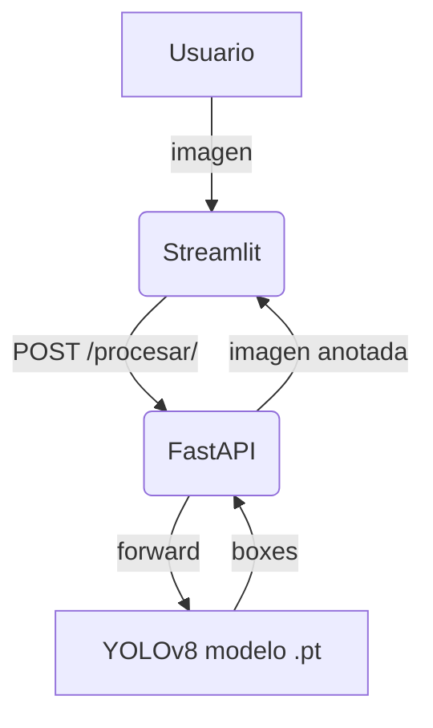

# Retail Object Detection – Proyecto V2-refactor

Este repositorio contiene **tres piezas** que, combinadas, implementan un sistema de detección de objetos en imágenes de góndolas de supermercado:

1. **Modelo YOLOv8** fine-tuned sobre el dataset SKU-110K
2. **Backend FastAPI** que expone el modelo como servicio REST (`/procesar/`)
3. **Frontend Streamlit** que permite al usuario subir imágenes y visualizar las predicciones

Las partes 1 y 2 viven en _este_ repositorio; la parte 3 se mantiene como **submódulo Git** (carpeta `frontend/`) apuntando al fork [`camilormv/BoundingBoxesDetector`](https://github.com/camilormv/BoundingBoxesDetector) en la misma rama `V2-refactor`.

---
## Contenido
1. [Requisitos](#requisitos)
2. [Clonado del proyecto](#clonado-del-proyecto)
3. [Ejecución rápida con Docker Compose](#ejecucion-rapida-con-docker-compose)
4. [Ejecución local sin Docker](#ejecucion-local-sin-docker)
5. [Arquitectura y flujos](#arquitectura-y-flujos)
6. [Entrenamiento y re-entrenamiento del modelo](#entrenamiento-del-modelo)
7. [Estrategia de ramas y submódulos](#estrategia-de-ramas)
8. [Actualización del submódulo frontend](#actualizar-frontend)
9. [Créditos](#creditos)

---
## 1. Requisitos <a name="requisitos"></a>

### Opción A – Docker (recomendado)
* Docker ≥ 20.10
* docker-compose v2 (si tu Docker no trae Compose V2 integrado)

### Opción B – Entorno local
* Python 3.11
* `pip` y compiladores de C/CUDA si vas a entrenar
* GPU + CUDA 11.8 (opcional pero recomendado para inferencia/entrenamiento)

---
## 2. Clonado del proyecto <a name="clonado-del-proyecto"></a>

```bash
# Clona la rama V2-refactor del backend
git clone -b V2-refactor https://github.com/aalvan/retail-object-detection.git
cd retail-object-detection

# Descarga el submódulo (frontend)
git submodule update --init --recursive
```

---
## 3. Ejecución rápida con Docker Compose <a name="ejecucion-rapida-con-docker-compose"></a>

1. **Compilar y levantar**
   ```bash
   docker compose up --build
   ```
   Se crean dos contenedores:
   | Servicio  | Imagen base          | Puerto | Descripción                               |
   |-----------|----------------------|--------|-------------------------------------------|
   | backend   | `python:3.11-slim`   | 8000   | FastAPI + Ultralytics + modelo YOLOv8     |
   | frontend  | `python:3.11-slim`   | 8501   | Streamlit UI                              |

2. **Probar la API**
   ```bash
   curl -F "file=@muestra.jpg" http://localhost:8000/procesar/ --output pred.jpg
   ```

3. **Abrir la interfaz gráfica**
   Navega a <http://localhost:8501> y carga una imagen.

Docker Compose crea una red interna; el contenedor `frontend` descubre al `backend` por el hostname `backend` y la variable `BACKEND_URL=http://backend:8000`.

Para detener los servicios:
```bash
docker compose down
```

---
## 4. Ejecución local sin Docker <a name="ejecucion-local-sin-docker"></a>

Instala dependencias (CPU):
```bash
python -m venv .venv && source .venv/bin/activate
pip install --upgrade pip
pip install -r requirements.txt
cd frontend && pip install -r requirements.txt && cd ..
```

En dos terminales:
```bash
# Terminal 1 – backend
uvicorn app.main:app --reload --port 8000

# Terminal 2 – frontend
export BACKEND_URL=http://localhost:8000
streamlit run frontend/app.py --server.port 8501
```

---
## 5. Arquitectura y flujos <a name="arquitectura-y-flujos"></a>



* **Streamlit (`frontend/`)**  carga la imagen en memoria y la envía vía `requests`.
* **FastAPI (`app/`)** recibe el archivo, lo pasa al predictor Ultralytics, dibuja las cajas y retorna la imagen procesada.

---
## 6. Entrenamiento del modelo <a name="entrenamiento-del-modelo"></a>

El script `training.py` muestra un ejemplo mínimo:
```python
from ultralytics import YOLO
model = YOLO("yolo11n.pt")
model.train(data="SKU-110K.yaml", epochs=50, imgsz=640)
```
El dataset se descarga automáticamente la primera vez (13 GB). Los resultados se almacenan en `runs/detect/train/` y el mejor checkpoint se renombra a `best.pt`.

Para continuar entrenando desde ese punto:
```bash
yolo train model=runs/detect/train/weights/best.pt data=mi_dataset.yaml epochs=30 imgsz=640
```

---
## 7. Estrategia de ramas y submódulos <a name="estrategia-de-ramas"></a>

| Repositorio                         | Rama principal | Rama de trabajo actual |
|-------------------------------------|----------------|------------------------|
| `aalvan/retail-object-detection`    | `main`         | `V2-refactor`          |
| `camilormv/BoundingBoxesDetector`   | `main`         | `V2-refactor`          |

Pasos efectuados en el refactor:
1. Creación de rama `V2-refactor` en backend y frontend.
2. Fusión de dependencias (`requirements.txt`).
3. Añadido de Dockerfiles (backend y frontend).
4. Creación de `docker-compose.yml`.
5. Configuración de la variable de entorno `BACKEND_URL`.
6. Inclusión del frontend como **submódulo Git** apuntando a la misma rama.

Ventaja: cada equipo puede evolucionar su parte de forma independiente conservando un único punto de orquestación.

---
## 8. Créditos <a name="creditos"></a>

Proyecto académico – Anyone AI (Final Project "Object Detection for in-store inventory management").

* Backend & entrenamiento: **Brenda Ávalos**, **Alexi Alva (aalvan)**, **Jhoel Chinchin (jhoelachp)**
* Frontend Streamlit: **Carla Salazar (CarlaSalHua)**
* Dataset SKU-110K: <https://github.com/eg4000/SKU110K_CVPR19>
* Framework Ultralytics YOLOv8: <https://github.com/ultralytics/ultralytics>