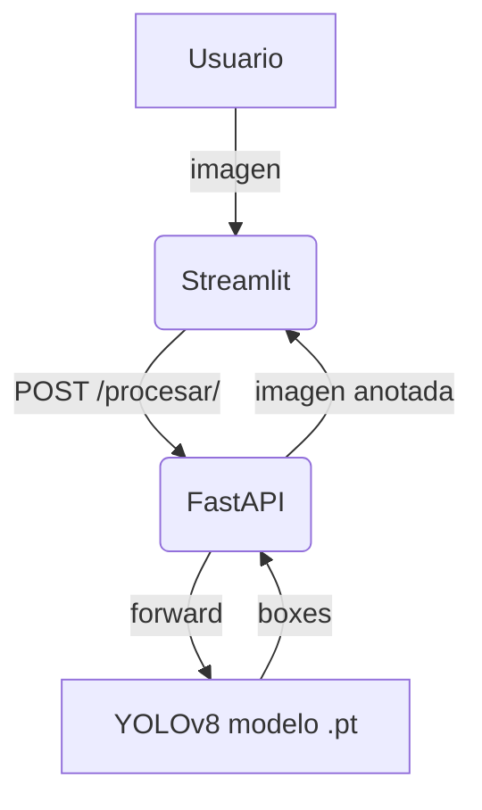

# Retail Object Detection

This repository contains an object detection system for images of supermarket shelves:

1. **YOLOv8 model** fine-tuned on the SKU-110K dataset
2. **FastAPI backend** exposing the model as a REST service (`/proces/`)
3. **Streamlit frontend** allowing the user to upload images and visualize predictions

---
## Contents
1. [Requirements](#requirements)
2. [Project cloning](#project-cloning)
3. [Quick run with Docker Compose](#quick-run-with-docker-compose)
4. [Local run without Docker](#local-run-without-docker)
5. [Architecture and flows](#architecture-and-flows)
6. [Model training and retraining](#model-training)
7. [Branch and submodule strategy](#branch-strategy)
8. [Credits](#credits)

---
## 1. Requirements <a name="requirements"></a>

### Option A – Docker (recommended)
* Docker ≥ 20.10
* docker-compose v2 (si tu Docker no trae Compose V2 integrado)

### Option B – Local environment
* Python 3.11
* `pip` y compiladores de C/CUDA si vas a entrenar
* GPU + CUDA 11.8 (opcional pero recomendado para inferencia/entrenamiento)

---
## 2. Project cloning <a name="project-cloning"></a>

```bash
# Clone the main branch of the backend
git clone -b main https://github.com/CarlaSalHua/Computer-Vision-Stream.git
cd Computer-Vision-Stream

```

---
## 3. Quick run with Docker Compose <a name="quick-run-with-docker-compose"></a>

1. **Build and start**
   ```bash
   docker compose up --build
   ```
   Two containers are created:
   | Service   | Base image           | Port   | Description                              |
   |-----------|----------------------|--------|-------------------------------------------|
   | backend   | `python:3.11-slim`   | 8000   | FastAPI + Ultralytics + YOLOv8 model     |
   | frontend  | `python:3.11-slim`   | 8501   | Streamlit UI                              |

2. **Test the API**
   ```bash
   curl -F "file=@muestra.jpg" http://localhost:8000/ --output pred.jpg
   ```

3. **Open the graphical interface**
   Navigate to <http://localhost:8501> and upload an image.

Docker Compose creates an internal network; the `frontend` container discovers the `backend` por el hostname `backend` y la variable `BACKEND_URL=http://backend:8000`.

To stop the services:
```bash
docker compose down
```

---
## 4. Local run without Docker <a name="local-run-without-docker"></a>

Install dependencies (CPU):
```bash
python -m venv .venv && source .venv/bin/activate
pip install --upgrade pip
pip install -r requirements.txt
cd frontend && pip install -r requirements.txt && cd ..
```

In two terminals:
```bash
# Terminal 1 – backend
uvicorn app.main:app --reload --port 8000

# Terminal 2 – frontend
export BACKEND_URL=http://localhost:8000
streamlit run frontend/app.py --server.port 8501
```

---
## 5. Architecture and flows <a name="architecture-and-flows"></a>



* **Streamlit (`frontend/`)**  loads the image into memory and sends it via `requests`.
* **FastAPI (`app/`)** receives the file, passes it to the Ultralytics predictor, draws the boxes, and returns the processed image.

---
## 6. Model training <a name="model-training"></a>

The `training.py` script shows a minimal example:
```python
from ultralytics import YOLO
model = YOLO("yolo11n.pt")
model.train(data="SKU-110K.yaml", epochs=50, imgsz=640)
```
The dataset is downloaded automatically the first time (13 GB). Results are stored in `runs/detect/train/` and the best checkpoint is renamed to `best.pt`.

To continue training from that point:
```bash
yolo train model=runs/detect/train/weights/best.pt data=mi_dataset.yaml epochs=30 imgsz=640
```

---
## 7. Branch and submodule strategy <a name="branch-strategy"></a>

| Repository                           | Main branch   | Current working branch |
|------------------------------------ -|---------------|------------------------|
| `CarlaSalHua/Computer-Vision-Stream` | `main`        |     `main`             |


Steps carried out in the refactor:
1. Merging of dependencies (`requirements.txt`).
2. Addition of Dockerfiles (backend y frontend).
3. Creation of `docker-compose.yml`.
4. Configuration of `BACKEND_URL` environment variable.
5. Inclusion of the frontend as a **submódulo Git** pointing to the same branch.

Advantage: each team can evolve their part independently while keeping a single orchestration point.

---
## 8. Credits <a name="credits"></a>

Academic project – Anyone AI (Final Project "Object Detection for in-store inventory management").

* Backend & training:: **Brenda Ávalos**, **Alexi Alva (aalvan)**, **Jhoel Chinchin (jhoelachp)**
* Streamlit frontend: **Carla Salazar (CarlaSalHua)**
* SKU-110K dataset: <https://github.com/eg4000/SKU110K_CVPR19>
* Ultralytics YOLOv8 framework: <https://github.com/ultralytics/ultralytics>